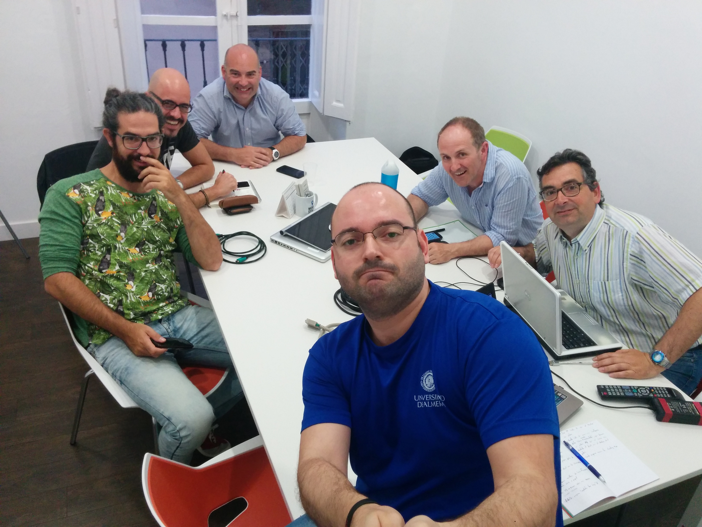

# III Reunión - 07/06/2016

Fecha - 07/06/2016

Hora  - 19:30

Lugar - Workspace Coworking

Asistentes:
* Adolfo Rosillo
* Jose María Martínez
* Cristóbal Contreras
* Iván Gonzalo Moyano
* Almudena Fernández
* Aitor Álvarez

Desarrollo - Intervenciones:
* Aitor propone empezar a dividirnos por grupos de trabajo.
* Gonzalo pide que cada uno diga que es lo que sabe hacer, para poder saber más o menos que podemos abordar. Así trataremos de fijar las ideas que tengamos.
* Almudena cree que su talento está en conexión de ideas, potenciando a cada uno.
* Adolfo argumenta varias ideas:
  * **De la necesidad virtud**, somos la huerta de Europa siendo un desierto. Debemos poder reflejar esto tanto en nuestras obras como en el proceso creativo.
  * **Explorar los límites**, hacer con lo mínimo lo máximo, tratar de llevar la tecnología o Python en concreto a donde falla. Un ejemplo podría ser tratar de hacer que Arduino mueva video en una tele vieja.
  * **Conexión**, si tenemos dos sedes (la UALy el Museo), hay que pensar en piezas con conectividad. Las dos localizaciones son complementarias, así que si haces algo en una, puedes ir al Museo a recoger lo que has hecho (ej, un tweet en la UAL y es impreso en el Museo).
* Aitor argumenta hablemos de identidad.
  * Parecido al concepto de Adolfo de inspirarnos en donde vivimos, inspirarnos en las personas.
  * Un ejemplo podrían ser letras que hacen un poema que te define. Al retirarte se ve que el poema es una huella dactilar.
  * Otro ejemplo podría ser usar la colmena generativa de Gonzalo, pero en lugar de una colmena, hacer un armadillo cuyas placas sean espejos.
* A Gonzalo se le ocurre la idea de una consola hecha con barro, con un pad algo tosco. Se elegiría un mensaje por partes, a modo de score de videojuegos retro. Cuando tienes el mensaje, se manda a una impresora que está en el museo y lo imprime con un boli. Habría que poner una webcam para poder verlo desde la UAL.
* Adolfo y Cristo hablan de implicar a IBM. La colaboración podría ser un estudio que les valiese a ellos, por ejemplo, que Watson estudie poesía.
* Cristo tiene la idea de decorar la sala con Pymientos (de plastico, con webcams o sensores dentro) donde además de las piezas, sea una experiencia estar en la expo. La idea está basada en el concepto de *Computación Ubicua*, para ello podemos *crear un invernadero* dentro del museo.
* Adolfo propone poner unos sensores de pulso cardíaco conectados con unas bombillas. Así se podría jugar con la iluminación de la sala a través del pulso de la gente.
* Gonzalo comenta poner una landing page, aunque sea en Facebook/Twitter para empezar a tener algo corporativo

