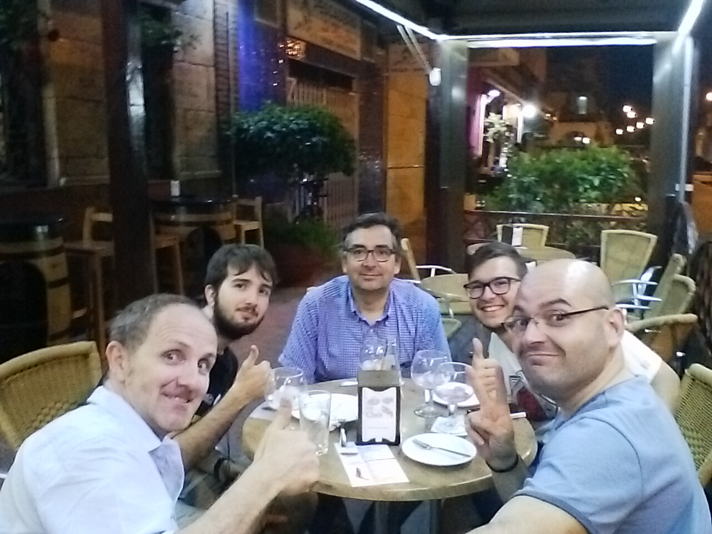

# IV Reunión - 21/06/2016

Fecha - 21/06/2016

Hora  - 19:00

Lugar - Workspace Coworking

Asistentes:
* Adolfo Rosillo
* Jose María Martínez
* Cristóbal Contreras
* Iván Gonzalo Moyano
* Fran Acién
* Hugo Rosillo
* Juan Luis Cano (por videoconferencia)

Desarrollo - Intervenciones:
* Gonzalo empieza enseñando los avances que ha hecho con Processing:
  * Koan - Son unas frases generativas del estilo a frase profundas de los sobres de azúcar #PabloCoelhoStyle
  * Agario - Es un juego donde se generan bolitas de distinto tipo. Algunas al chocar se fusionan en una bola mayor. Otras explotan las mayores en bolitas más pequeñas. Todo es estocástico e impredecible. Cristo comenta que al chocar podían sonar notas musicales que dependen del tamaño de estas.
  * AGAP (Asynchronous Generative Art Protocol) - Es un concepto sobre generar un paquete de datos de una obra, que pueda reusarse para generar otra obra. La idea es compartir los datos de cada obra para poder tener obras derivadas que generen una red de obras.
* Adolfo habla sobre explorar los limites y pone como ejemplo a un artista con artritis en las manos y se puso a pintar con los dedos de los pies. Hay que buscar glitches, fallos en Python y explotarlos.
* Jose Mª comenta que hay un ruso que transforma cuadros en música.
* Cristo cree que estaría gracioso hacerlo al revés, coger música y transformarla en cuadros. Por ejemplo poniendo una base musical + koan hechos con tweets + filtros. Insiste en que debemos de buscar nuestra identidad / brand y su storytelling
  * Conexión (Almería está incomunicada, así que la solución pasa por el IoT)
  * Explorar límites (meter Arte en la PyConEs)
  * Optimización de recursos (reciclaje, cuatro plasticos dan de comer a EU)
* Se incorpora Fran y habla de sus gustos:
  * Le gusta el downtempo que usaban los DJs antes para hacer música.
  * Pone de ejemplo a Avalandis, que introdujo más de 3500 samples en un disco y lo petaron con millones de visitas.
  * Tiene una idea basada en una orquesta hecha con muñecos de Lego
* Jose Mª dice que Goran Levin ya ha hecho algo parecido a un video de facebook donde se ve una mesa con bolitas que generan notas musicales. Pero Goran usa tazas que segun la posición, genera notas distintas.
* Cristo indica que ya tenemos montada la infraestructura (hosting, dominios, Github, redes sociales), solo falta montar la web y el logo.
* Gonzalo propone que la siguiente reunión sea un Desing & Beers en su casa.

