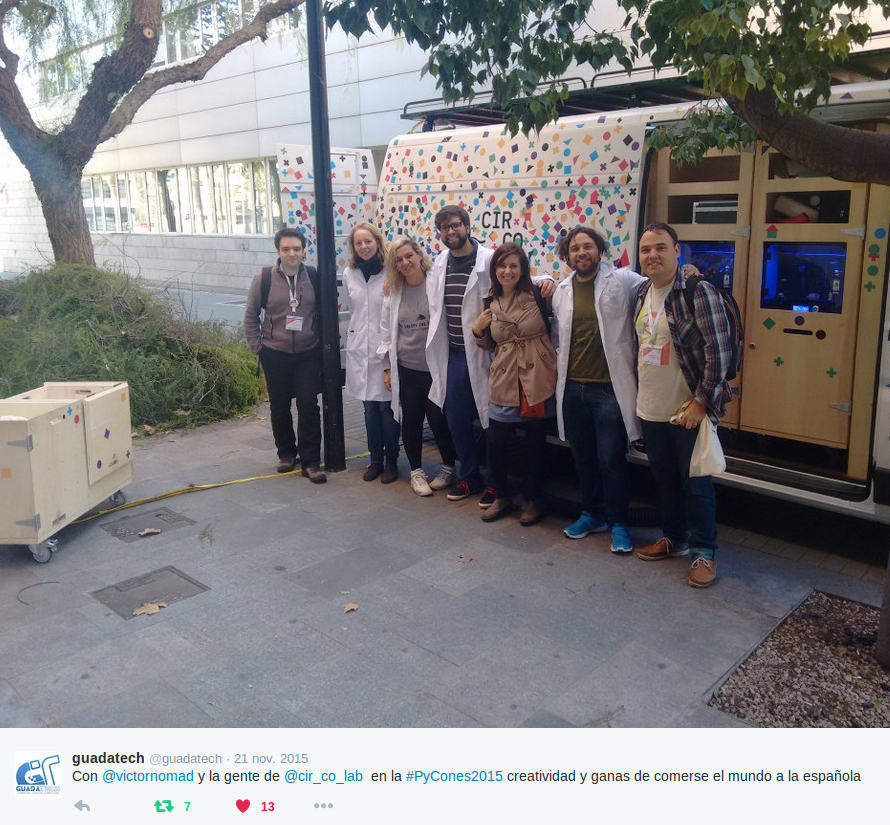
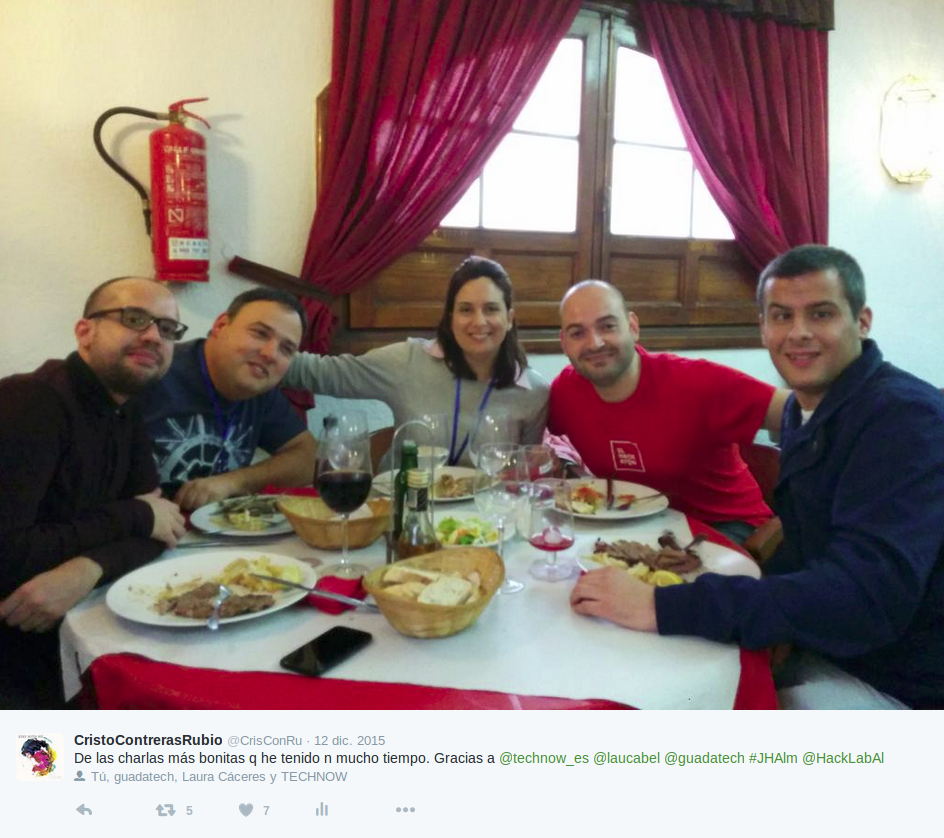
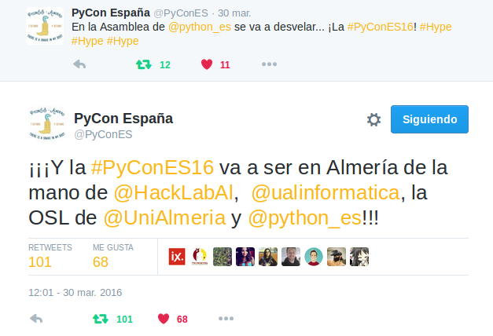
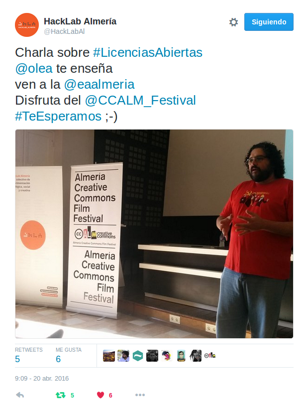

# Comienzos

Todo empieza con una expedición [Hacklabera](http://hacklabalmeria.net/) que acude a Valencia a disfrutar de la [PyConEs 2015](http://2015.es.pycon.org/es/).

Nuestros compañeros Laura Cáceres y Diego Martínez de [Guadatech](http://www.guadatech.com/), disfrutaron los días 20, 21 y 22 de Noviembre de un evento dedicado a uno de los lenguajes de programación más _sui genereis_ que existen, [Python](https://es.wikipedia.org/wiki/Python). Allí pudieron contactar con gente muy válida y diversa, como nuestros amigos de [CircoLab](http://www.circolab.org/).

A su vuelta a Almería, coincidimos en las [Jornadas Hacklab Almería 2015](http://hacklabalmeria.net/2015/12/11/ii-jornadas-hacklab.html) de El Ejido. Durante una de esas comidas que alimentan más por lo que escuchas, que por lo que engulles, nos enteramos sobre rumores que apuntan a que la próxima PyConEs puede ser Granada.

Durante el periodo de las Navidades, a Cristo se le ocurre que desde Hacklab Almería se podía trabajar el tema de Python durante 2016. Así podríamos abordar la PyConEs como una parte activa, y no como meros espectadores. Tras intentos fallidos de reunir al núcleo de Hacklab, y transmitirles esto a sus compañeros, una tarde de Febrero, en una cafetería local junto a [Ismael Olea](http://olea.org/) (uno de los 3 fundadores de Hacklab Almería y _"madre"_ de este), Cristo consigue por fin que sean escuchadas sus ideas.

Lo maravilloso que tiene este mundo del Open Source, es que las ideas están ahí, para el que las quiera coger y mejorarlas. Ismael se hace eco de esto, y en un alarde de genialidad consigue que un mes después [Python España](http://www.es.python.org/) elija a Almería como sede oficial para la PyConEs 2016.

Tras conocer la noticia, Adolfo Rosillo (fundador de Hacklab Almería) le comenta a Cristo que podrían tratar de _invadir_ el evento con una exposición de cuadros hechos con Python. Después de unos días, el 20 de Abril acudimos a ver la charla sobre _"Licencias Abiertas"_ de Ismael en el _[Creative Commons Almería Festival](http://ccalm.es/)_.

Al acabar, Cristo le hace una proposición en firme a Adolfo y Jose María Martínez García (miembro de Hacklab Almería con inquietudes artísticas) de hacer un grupo de trabajo en firme para poder llevar acabo la idea de Adolfo. Los 3 se comprometen a ello y deciden tener una primera reunión para hablar sobre ello en un par de semanas.

Ese mismo día por la noche, Cristo decide ser parte en la [2ª reunión organizativa de la PyConEs](https://lists.es.python.org/pipermail/general/2016-April/003201.html), para transmitir esto entre otras cosas. La respuesta por parte de la organización es muy positiva, y dan vía libre al proyecto.