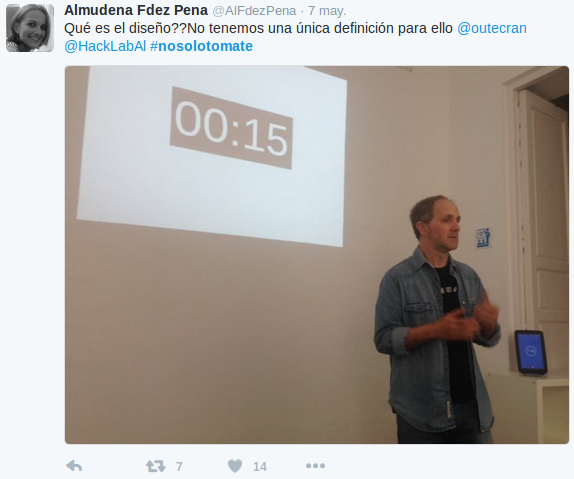
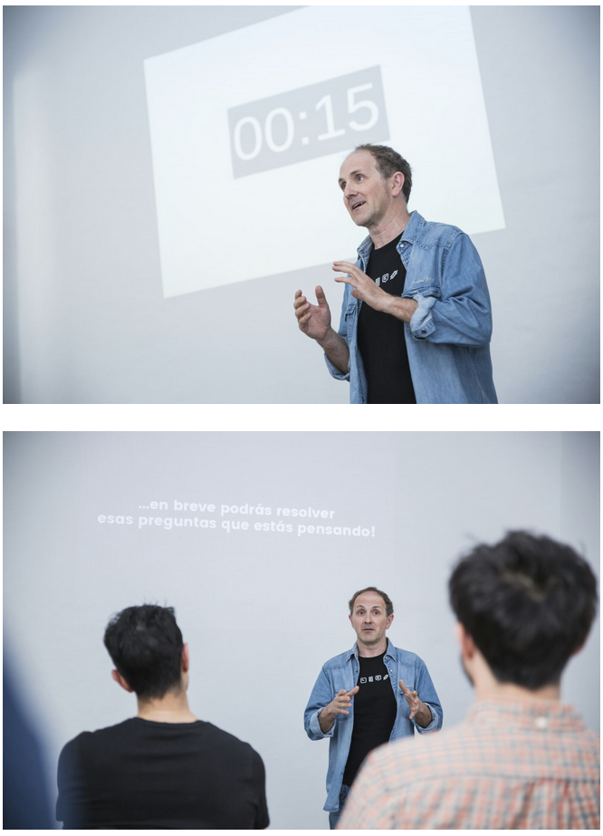
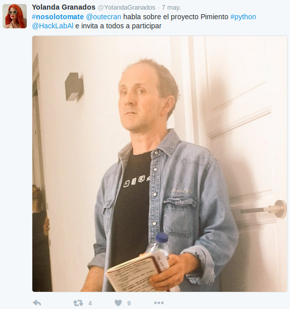
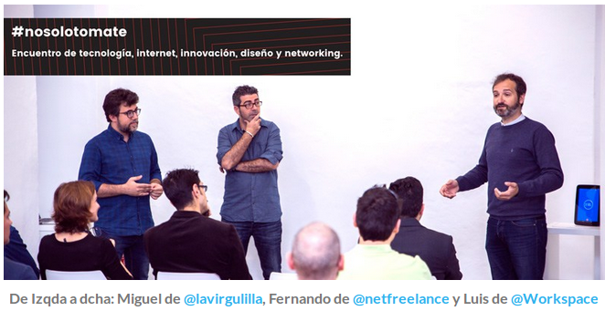

# Fundación - 03/05/2016
Fecha - 03/05/2016

Hora  - 19:00

Lugar - Cafetería Roypa
Asistentes:
* Adolfo Rosillo
* Jose Maria Martínez
* Cristóbal Contreras

El 3 de Mayo, a las 7:00 pm, quedamos en una cafetería cercana a los 3 (Adolfo, Jose María y Cristo). Era una tarde de mucho viento, pero de una temperatura agradable, de esos días que te dá Almería que te hacen amar esta tierra pese a su ingratitud.

Empezamos por ser conscientes de en que punto nos encontramos:

* La PyConEs será los días 7, 8 y 9 de Octubre. Luego contamos con alrededor de 5 meses para tratar de montar todo el tinglado.
* Tenemos hasta finales de Junio para mandar nuestra propuesta de charla.
* Python debe ser el hilo conductor de todo aquello que llevemos a cabo.
* Tenemos que buscar nuestras señas de identidad.
* Adolfo habla sobre la revista [FUSE](http://www.fusemagazineonline.com/), las tipografías digitales, y como la primera de estas está relacionada con Python.
* Adolfo sostiene la teoría de que [Guido van Rossum](https://www.python.org/~guido/), creador de Python, está influenciado por su hermano, [Just van Rossum](https://en.wikipedia.org/wiki/Just_van_Rossum), que a parte de programador, es diseñador. Eso se refleja en ciertos aspectos, como el minimalismo del lenguaje y su gusto por la estética que se plasma en el [Zen de Python](https://www.python.org/dev/peps/pep-0020/).
* Creemos que la tecnología ideal para empezar a movernos será [Processing](https://processing.org/) en su versión Python, [Processing.Py o PyProcessing](http://py.processing.org/).
* Cristo propone que todo el proceso creativo del proyecto se documente para presentar un libro también en la PyConEs.

Después de todo esto, nos despedimos con las siguientes tareas por hacer:

* Nos reuniremos dentro de dos semanas. 
* Necesitamos una landing page donde poder contar el proyecto.
* Adolfo buscará gente para colaborar con nosotros.
* Jose María podría preparar un taller de PyProcessing de uno 40min para los demás.
* Cristo montará la infraestructura para coordinarnos (herramientas como Slack, Taiga, Github,...) y dará un taller de iniciación.

Antes de irnos, Cristo habla sobre que nombre debería tener el proyecto ¿HacklArt, PyArt? Adolfo incide en que todo lo que lleve _"art"_ está muy quemado, hay que buscar otras alternativas. Cristo insiste en que una de sus marcas es que no tenemos nada, y de ello sacamos provecho, así que el nombre debe evocar o provenir de algo mundano, como una hortaliza. Jose María, en un golpe de espontaneidad e inspiración divina, con la llama de Pentecostés sobre su testa dice **"¡Pymiento!"**. Cristo queda encantado con el nombre, pero a Adolfo no le convence del todo, ya que como dice Jose María "...en Murcia, cuando algo es malo o un churro, decimos que es un pimiento...". Cristo sigue fascinado con el nombre y le pide a sus compañeros que le den una pensada, pues cree que la inspiración de Jose María ha sido una genialidad.

Solo 4 días después, Adolfo tiene la oportunidad de dar una charla en el [primer evento de #nosolotomate](http://www.nosolotomate.es/blog/primer-evento-de-nosolotomate/#more-1208). A este evento acuden distintos profesionales de Almería, tratando de poner en valor la provincia mirándola desde un punto de vista diferente. Adolfo da una charla titulada **"[Deja de preguntarte lo que el diseño puede hacer por ti y empieza a pensar lo que tu puedes hacer por él](http://www.netfreelance.info/nosolotomate-almeria-es-mas-que-la-huerta-de-europa/#10_gt_Deja_de_preguntar_por_lo_que_el_diseno_puede_hacer_por_ti_y_empieza_a_pensar_en_lo_que_tu_puedes_hacer_por_elAdolfo_Rosillo)"** (el título es más largo que la charla). 

Siendo seducido por el nombre de Jose María, **Pymiento**, Adolfo aprovecha la charla para dar a conocer a los ponentes nuestras intenciones. #ThePymientoProject se convierte en un compromiso real y público por nuestras parte.

Tras el magnífico evento, Adolfo consigue entablar conversación con los organizadores del evento y también fundadores del lugar donde se encuentran, el [Workspace Coworking](http://www.workspace.es/): [Luis Roca](https://twitter.com/Bukart), [Miguel Ángel González](https://twitter.com/lavirgulillaes?lang=es) y [Fernando Mariano](https://twitter.com/netfreelance).

Adolfo les comenta la posibilidad de que entren a colaborar con nosotros, y que para llevar esto a cabo necesitaríamos un centro de operaciones. Los tres son bastantes receptivos al respecto, están interesados por **Pymiento** y proponen que Workspace podía ser ese lugar de encuentro. Así pues queda fijada que la siguiente reunión será allí, donde poder parlamentar tranquilamente sobre todo esto.
