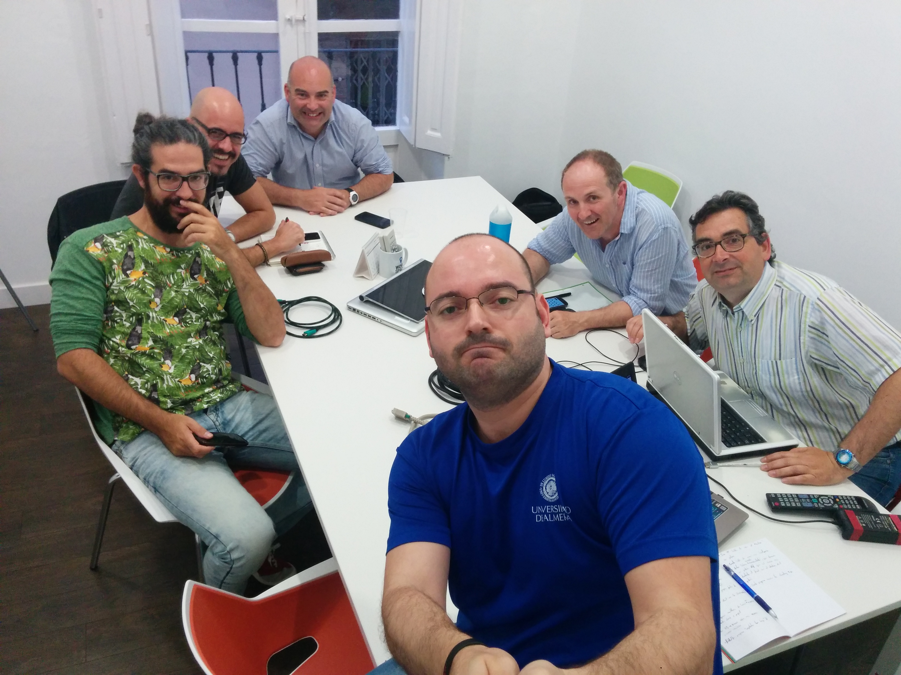

# II Reunión - 01/06/2016

Fecha - 01/06/2016

Hora  - 19:30

Lugar - Workspace Coworking

Asistentes:
* Adolfo Rosillo
* Jose María Martínez
* Cristóbal Contreras
* Luis Roca
* Favio Gutiérrez
* Iván Gonzalo Moyano
* Almudena Fernández
* Aitor Álvarez

Desarrollo - Intervenciones:
* Adolfo tiene novedades
  * El Lúnes con los gerentes del [Museo de Almería](http://www.museosdeandalucia.es/cultura/museos/MAL/).
  * El Museo nos cede la Sal@ (Sala @) para exponer en la PyConEs y durante todo el mes siguiente.
  * Hay que encontrar un lugar adecuado en la Universidad para las obras.
  * Cristo celebra el logro de Adolfo pero no está del todo de acuerdo en exponer en la fecha de la PyConEs. Cree que es una "contraprogramación" que puede afectar al proyecto, debido sobretodo a las mejorables comunicaciones Universidad-Museo en transporte público, y que el público potencial está en la Universidad.
  * Adolfo le explica que la exposición tiene sentido ese día, pues es cuando hay más gente (de fuera sobretodo) para llenarlo, y que no hacerlo ese día es incluso una falta de consideración para con el museo.
  * Cristo no lo entiende en ese momento, pero con el paso de los días se dará cuenta de que Adolfo está en lo cierto.
* Gonzalo enseña sus progresos he ideas:
  * Ha estado trabajando con Processing. Por ejemplo, a partir de una imagen (un dibujo a lápiz y papel escaneado) ha encontrado los puntos más oscuros y los ha unido mediante líneas para ver un nuevo dibujo sobre el anterior.
  * Cree que sería interesante hablar con un compañero suyo herrero, para exponer unas esculturas de hierro con mappings de distintas obras a papel.
  * También se ha inspirado en un proyecto de mostrado por Adolfo, donde se hace música con un receptor óptico y discos girando manualmente. Puede hablar con un DJ para tratar de crear una mesa de este estilo. Ha hecho un prototipo de los discos con en el ordenador.

* Adolfo propone que tratemos de explorar los límites de Python **¡¡¡Explotemos los bugs!!!**
* Jose Mª habla de usar el proyecto [_Menhir_](https://menhir.es/category/videosphotos/), de la compañera [Coco Moya](http://www.cocomoya.net/), y usar elementos de Almería y golpes para generar la música.
* Aitor propone _"obras musicales minimalistas"_, es decir, las piezas se componen de pequeños patrones que al inicio sean distintas del final, debido a un pequeño desfase en estos.
* Cristo por su parte:
  * Hace hincapié en que es necesario para todo esto tener un _**storytelling**_, ya que las piezas sin esto no son muy diferentes a cualquier proyecto maker.
  * Propone que mirará el tema de la landing page con Django.
* Fijamos la siguiente reunión para el Mártes pŕoximo a las 19:30.

